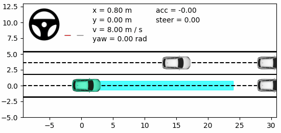
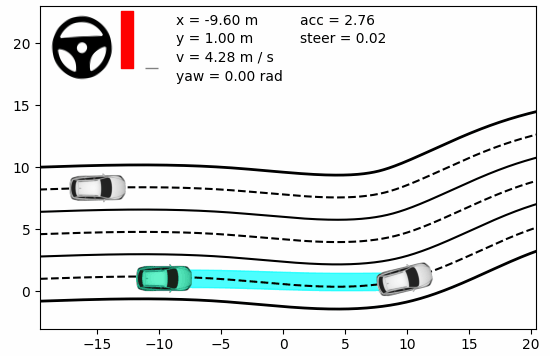
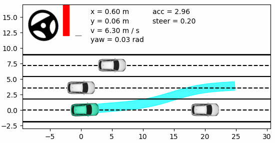

# toy-example-of-iLQR
This repository implements an **C**onstrained **I**terative **L**inear **Q**uadratic **R**egulator (**CILQR**) algorithm that incorporates constraints in the environment for on-road autonomous motion planning. For more information, see [LQR与iLQR：从理论到实践【详细】](https://zhuanlan.zhihu.com/p/715102938)

<div align=center>
  
</div>

## 1. Prerequisites

- Tested on WSL2 Ubuntu 20.04🐧
- Python >= 3.6.10, matplotlib, numpy
- Other dependencies: [fmt](https://github.com/fmtlib/fmt), [yamp-cpp](https://github.com/jbeder/yaml-cpp)
- Install yaml:
  Reference: https://zhuanlan.zhihu.com/p/626825665, clone repo and make in host
  Modify CMakeLists.txt:
    find_package(fmt REQUIRED)
    find_package(spdlog REQUIRED)
    find_package(yaml-cpp REQUIRED) //cannot find yaml-cpp, so must indicate the include_directiories and target_link_libraries
    
    include_directories("/usr/include/eigen3")
    include_directories(${CMAKE_CURRENT_LIST_DIR})
    include_directories(${PROJECT_SOURCE_DIR}/include)
    include_directories(${PROJECT_SOURCE_DIR}/3rdparty)
    
    set(YAML_CPP_INCLUDE_DIRS /usr/local/include)
    include_directories(${YAML_CPP_INCLUDE_DIRS})
    
    file(GLOB SOURCE_FILES "${PROJECT_SOURCE_DIR}/src/*.cpp")
    set(3RDPARTY matplotlib_cpp fmt::fmt spdlog::spdlog /usr/local/lib/libyaml-cpp.so.0.8.0)
    
    add_executable(motion_planning ${SOURCE_FILES})
    target_link_libraries(motion_planning ${3RDPARTY})


## 2. Build

Clone the repository and make:

```shell
git clone https://github.com/PuYuuu/toy-example-of-iLQR.git
cd toy-example-of-iLQR
cmake -B build
cmake --build build
```

## 3. Execute examples

### 3.1 Basic examples of LQR

You can find the corresponding python script file in the `scripts` folder.

1. **Closed-loop response of linear system under LQR controller**

```shell
python scripts/0-lqr-demo.py
```

2. **Path tracking using LQR**

```shell
python scripts/1-lqr-pathtracking.py
```

3. **Simple version of on-road motion planning by CILQR**

```shell
python scripts/2-cilqr-motionplanning.py
```

### 3.2 Autonomous driving motion planning with CILQR

Find the executable file in the build folder, and specify the configuration file path through `-c` to start the program.

```shell
./build/motion_planning -c ./config/scenario_three_bend.yaml
```

<div align=center>
  
</div>

In addition, you can manually modify the contents of the configuration file, including algorithm parameters, initial conditions, scenario information, etc., and observe the performance of CILQR in different scenarios. For example:

```
./build/motion_planning -c config/scenario_three_straight.yaml
```

<div align=center>

  
</div>
